# OpenSandbox CLI

A command-line interface for managing OpenSandbox environments from your terminal. Built on top of the [OpenSandbox Python SDK](../sdks/sandbox/python/README.md), the CLI provides intuitive commands for sandbox lifecycle management, file operations, command execution, and diagnostics.

## Installation

### pip

```bash
pip install opensandbox-cli
```

### uv

```bash
uv tool install opensandbox-cli
```

### pipx (recommended for global CLI usage)

```bash
pipx install opensandbox-cli
```

## Overview

```bash
osb --help
```

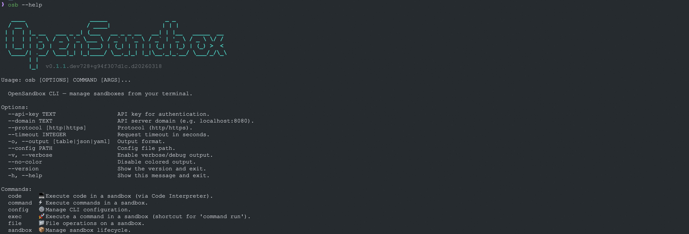

## Quick Start

### Step 0: Start the OpenSandbox Server

Before using the CLI, make sure the OpenSandbox server is running. See the root [README.md](../README.md) for startup instructions.

```bash
opensandbox-server
```

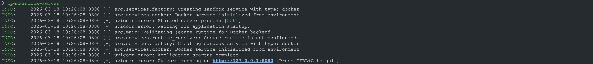

### Step 1: Install the CLI

```bash
cd cli
uv sync
uv run osb --help
```

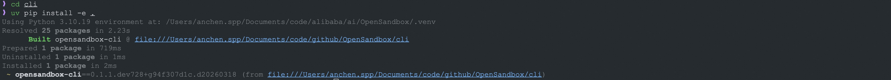

### Step 2: Initialize Configuration

```bash
osb config init
osb config set connection.domain localhost:8080
osb config set connection.protocol http
```

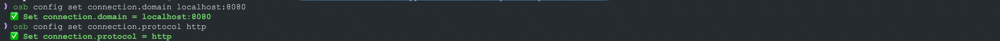

### Step 3: Create a Sandbox

```bash
osb sandbox create --image python:3.12
```

Or configure defaults once and omit repeated flags:

```bash
osb config set defaults.image python:3.12
osb config set defaults.timeout 15m
osb sandbox create
```

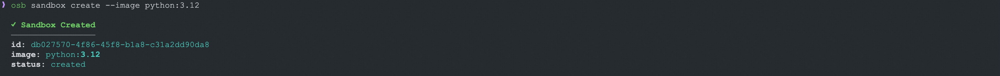

### Step 4: List Sandboxes

```bash
# Table output (default)
osb sandbox list

# JSON output for scripting
osb -o json sandbox list
```

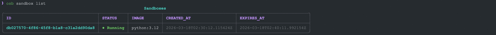

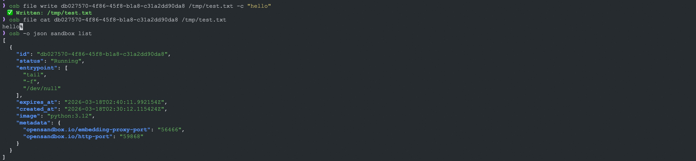

### Short ID Matching

Like Docker, you don't need to type the full sandbox ID — just enough characters to uniquely identify the target sandbox:

```bash
# Full ID
osb sandbox get db027570-4f86-45f8-b1a8-c31a2dd90da8

# Short prefix — as long as it's unambiguous
osb sandbox get db02
osb exec db02 -- echo "hello"
```

If the prefix matches multiple sandboxes, the CLI will report an error listing the matches so you can be more specific.

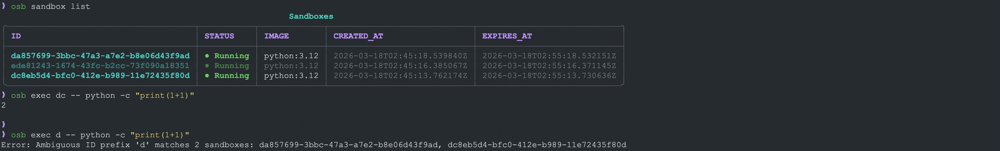

### Step 5: Execute Commands

```bash
osb exec <sandbox-id> -- echo "hello world"
osb exec <sandbox-id> -- python -c "print(1+1)"
```

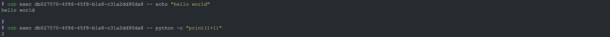

### Step 6: File Operations

```bash
# Write a file
osb file write <sandbox-id> /tmp/test.txt -c "hello"

# Read it back
osb file cat <sandbox-id> /tmp/test.txt
```

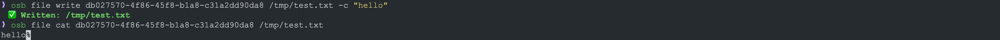

### Step 7: Cleanup

```bash
osb sandbox kill <sandbox-id>
osb sandbox list
```


## Command Reference

### `osb sandbox` — Lifecycle Management

| Command    | Description                                 |
| ---------- | ------------------------------------------- |
| `create`   | Create a new sandbox                        |
| `list`     | List sandboxes (with optional filters)      |
| `get`      | Get sandbox details by ID                   |
| `kill`     | Terminate one or more sandboxes             |
| `pause`    | Pause a running sandbox                     |
| `resume`   | Resume a paused sandbox                     |
| `renew`    | Renew sandbox expiration                    |
| `endpoint` | Get public endpoint for a sandbox port      |
| `health`   | Check sandbox health                        |
| `metrics`  | Get sandbox resource metrics (CPU, memory)  |

### `osb command` — Command Execution

| Command     | Description                               |
| ----------- | ----------------------------------------- |
| `run`       | Run a shell command in the sandbox        |
| `status`    | Get command execution status              |
| `logs`      | Get background command logs               |
| `interrupt` | Interrupt a running command               |

### `osb exec` — Quick Command Shortcut

```bash
osb exec <sandbox-id> -- <command>
```

Shortcut for `osb command run`. Everything after `--` is passed as the command.

### `osb file` — File Operations

| Command    | Description                                |
| ---------- | ------------------------------------------ |
| `cat`      | Read file contents                         |
| `write`    | Write content to a file                    |
| `upload`   | Upload a local file to the sandbox         |
| `download` | Download a file from the sandbox           |
| `rm`       | Delete files                               |
| `mv`       | Move or rename a file                      |
| `mkdir`    | Create directories                         |
| `rmdir`    | Remove directories                         |
| `search`   | Search for files by pattern                |
| `info`     | Get file/directory metadata                |
| `chmod`    | Set file permissions                       |
| `replace`  | Find and replace content in a file         |

### `osb devops` — Experimental DevOps Diagnostics

| Command   | Description                                          |
| --------- | ---------------------------------------------------- |
| `logs`    | Retrieve container/pod logs                          |
| `inspect` | Retrieve detailed container/pod inspection info      |
| `events`  | Retrieve events related to a sandbox                 |
| `summary` | One-shot diagnostics: inspect + events + logs combined |

These diagnostics commands are currently experimental. They are implemented by the server and exposed by the CLI, but are not yet part of the public `specs/` API contract and may change before being formalized.

```bash
# Quick diagnostics summary
osb devops summary <sandbox-id>

# Get last 500 log lines
osb devops logs <sandbox-id> --tail 500

# Get logs from the last 30 minutes
osb devops logs <sandbox-id> --since 30m

# Detailed container/pod inspection
osb devops inspect <sandbox-id>

# View events (up to 100)
osb devops events <sandbox-id> --limit 100
```

All devops commands return plain text output, making them ideal for both human reading and AI agent consumption.

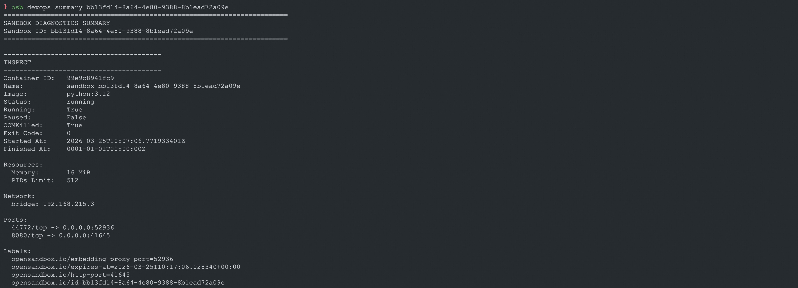

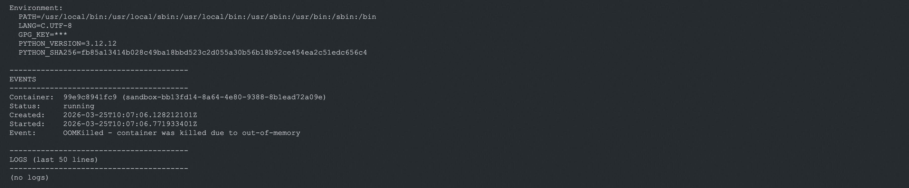

### `osb skills` — AI Coding Skills

| Command     | Description                                          |
| ----------- | ---------------------------------------------------- |
| `install`   | Install OpenSandbox troubleshooting skill for AI tools |
| `list`      | List supported targets and their install status      |
| `uninstall` | Remove installed skill from AI tools                 |

The troubleshooting skill enables AI coding assistants to automatically diagnose sandbox issues (OOM, crashes, image pull errors, etc.). Supported targets:

| Target    | AI Tool          | Install Location |
| --------- | ---------------- | ---------------- |
| `claude`  | Claude Code      | `~/.claude/skills/` |
| `cursor`  | Cursor           | `~/.cursor/rules/` |
| `codex`   | Codex            | `~/.codex/instructions.md` |
| `copilot` | GitHub Copilot   | `~/.github/copilot-instructions.md` |
| `windsurf`| Windsurf         | `~/.windsurfrules` |
| `cline`   | Cline            | `~/.clinerules` |

```bash
# Install for Claude Code (default)
osb skills install

# Install for a specific tool
osb skills install --target cursor

# Install for all supported tools
osb skills install --target all

# Check install status
osb skills list

# Uninstall
osb skills uninstall --target claude
```

### `osb config` — Configuration

| Command | Description                                |
| ------- | ------------------------------------------ |
| `init`  | Create a default config file               |
| `show`  | Show resolved configuration                |

## Configuration

The CLI resolves configuration from multiple sources with the following priority (highest to lowest):

1. **CLI flags** — `--api-key`, `--domain`, `--protocol`, `--timeout`
2. **Environment variables** — `OPEN_SANDBOX_API_KEY`, `OPEN_SANDBOX_DOMAIN`, `OPEN_SANDBOX_PROTOCOL`, `OPEN_SANDBOX_REQUEST_TIMEOUT`, `OPEN_SANDBOX_OUTPUT`
3. **Config file** — `~/.opensandbox/config.toml` (or path specified via `--config`)
4. **SDK defaults**

## Development

For local CLI development in this monorepo, prefer `uv sync` from the `cli/` directory. That workflow honors the local `[tool.uv.sources]` override for `opensandbox`, so the CLI resolves against the checked-out SDK instead of the published package.

```bash
cd cli
uv sync
uv run osb --help
```

If you specifically need an editable install into another environment, install the SDK dependencies from their local paths first, then install the CLI.

### Config File Format

```toml
[connection]
api_key = "your-api-key"
domain = "localhost:8080"
protocol = "http"
request_timeout = 30

[output]
format = "table"    # table | json | yaml
color = true

[defaults]
image = "python:3.11"
timeout = "10m"
```

## Global Options

| Option                        | Description                      |
| ----------------------------- | -------------------------------- |
| `--api-key TEXT`              | API key for authentication       |
| `--domain TEXT`               | API server domain                |
| `--protocol [http\|https]`    | Protocol                         |
| `--timeout INTEGER`           | Request timeout in seconds       |
| `-o, --output [table\|json\|yaml]` | Output format              |
| `--config PATH`               | Config file path                 |
| `-v, --verbose`               | Enable debug output              |
| `--no-color`                  | Disable colored output           |
| `--version`                   | Show version                     |

## Output Formats

The CLI supports three output formats via the `-o` / `--output` flag:

- **`table`** (default) — Human-friendly tables powered by [Rich](https://github.com/Textualize/rich)
- **`json`** — Machine-readable JSON
- **`yaml`** — YAML output

```bash
# Table (default)
osb sandbox list

# JSON for scripting
osb -o json sandbox list

# YAML
osb -o yaml sandbox list
```
