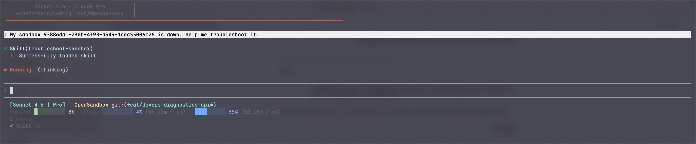
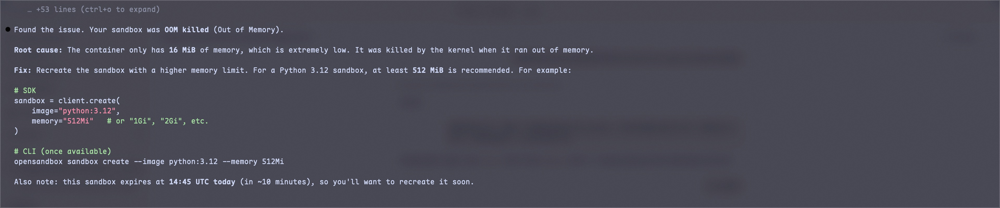

# DevOps Diagnostics Example: Diagnosing an OOM Kill

This guide walks through a real-world example of using the OpenSandbox DevOps diagnostics to identify and resolve an Out-of-Memory (OOM) issue.

## Scenario

A sandbox is created with a very small memory limit, and a memory-hungry process is executed inside it, causing the container to be killed by the OOM killer.

## Step 1: Create a memory-limited sandbox

Create a sandbox with only 16 MiB of memory:

```bash
osb sandbox create --image python:3.12 --resource memory=16Mi
```

Note the sandbox ID from the output (e.g. `bb13fd14-8a64-4e80-9388-8b1ead72a09e`).

## Step 2: Trigger an OOM kill

Run a Python command that tries to allocate 100 MB of memory, far exceeding the 16 MiB limit:

```bash
osb exec <sandbox-id> -- python3 -c "x = 'A' * (1024 * 1024 * 100)"
```

The command will fail with a `CommandExecError`, indicating the container was killed.

## Step 3: Diagnose with DevOps diagnostics

### Using CLI

```bash
osb devops summary <sandbox-id>
```

### Using HTTP API

```bash
curl http://localhost:8080/v1/sandboxes/<sandbox-id>/diagnostics/summary
```

### Expected output

The summary output will show something like:

```
========================================================================
SANDBOX DIAGNOSTICS SUMMARY
Sandbox ID: bb13fd14-8a64-4e80-9388-8b1ead72a09e
========================================================================

----------------------------------------
INSPECT
----------------------------------------
Container ID:   a1b2c3d4e5f6
Name:           sandbox-bb13fd14
Image:          python:3.12
Status:         exited
Running:        False
Paused:         False
OOMKilled:      True
Exit Code:      137
Started At:     2026-03-25T10:01:13Z
Finished At:    2026-03-25T10:01:15Z

Resources:
  Memory:       16 MiB

----------------------------------------
EVENTS
----------------------------------------
Container:  a1b2c3d4e5f6 (sandbox-bb13fd14)
Status:     exited
Created:    2026-03-25T10:01:13Z
Started:    2026-03-25T10:01:13Z
Finished:   2026-03-25T10:01:15Z
Event:      OOMKilled - container was killed due to out-of-memory
Event:      Exited with code 137

----------------------------------------
LOGS (last 50 lines)
----------------------------------------
(no logs)
```

## Step 4: Identify the problem

Key indicators in the output:

| Field | Value | Meaning |
|-------|-------|---------|
| `OOMKilled` | `True` | Container was terminated by the OOM killer |
| `Exit Code` | `137` | SIGKILL (128 + 9), consistent with OOM kill |
| `Memory` | `16 MiB` | Very low memory limit |

## Step 5: Resolution

Recreate the sandbox with a larger memory limit:

```bash
osb sandbox create --image python:3.12 --resource memory=512Mi
```

Or via HTTP API:

```bash
curl -X POST http://localhost:8080/v1/sandboxes \
  -H "Content-Type: application/json" \
  -d '{
    "image": {"uri": "python:3.12"},
    "resource": {"memory": "512Mi"}
  }'
```

## AI-Assisted Troubleshooting

With the [troubleshooting skill](../skills/troubleshoot-sandbox/SKILL.md), AI agents (e.g. Claude Code) can automatically diagnose sandbox issues. Simply describe the problem, and the agent will run the appropriate diagnostics commands and provide a root cause analysis:





## Quick Reference

| Symptom | Diagnostic Command | What to Look For |
|---------|-------------------|------------------|
| OOM Kill | `osb devops inspect <id>` | `OOMKilled: True`, `Exit Code: 137` |
| App Crash | `osb devops logs <id> --tail 200` | Error messages, stack traces |
| Stuck Pending | `osb devops events <id>` | `ImagePullBackOff`, scheduling failures |
| Network Issue | `osb devops inspect <id>` | Ports, network config, IP addresses |
