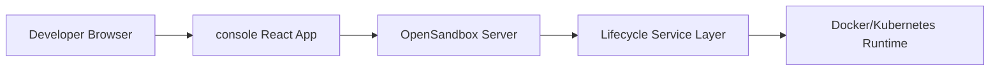
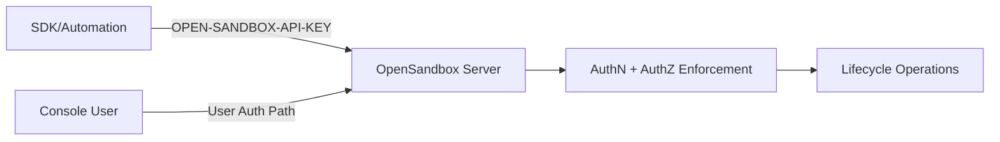

# OSEP-0006: Developer Console for Sandbox Operations with Phased Auth Model

<!-- toc -->

- [Summary](#summary)
- [Motivation](#motivation)
  - [Goals](#goals)
  - [Non-Goals](#non-goals)
- [Requirements](#requirements)
- [Proposal](#proposal)
  - [Notes/Constraints/Caveats](#notesconstraintscaveats)
  - [Risks and Mitigations](#risks-and-mitigations)
- [Design Details](#design-details)
  - [Current State](#current-state)
  - [Phase 1 (MVP): Console + Server-Side RBAC Without DB](#phase-1-mvp-console--server-side-rbac-without-db)
  - [Phase 2: OIDC/JWT + PostgreSQL RBAC and Audit](#phase-2-oidcjwt--postgresql-rbac-and-audit)
  - [Role and Permission Model](#role-and-permission-model)
  - [Ownership and Team Scoping Without Database](#ownership-and-team-scoping-without-database)
  - [Server Changes](#server-changes)
  - [Console Application Design](#console-application-design)
  - [API and Spec Changes](#api-and-spec-changes)
  - [Operational Rollout](#operational-rollout)
- [Test Plan](#test-plan)
- [Drawbacks](#drawbacks)
- [Alternatives](#alternatives)
- [Infrastructure Needed](#infrastructure-needed)
- [Upgrade & Migration Strategy](#upgrade--migration-strategy)
<!-- /toc -->

## Summary

This proposal is based on [#348](https://github.com/alibaba/OpenSandbox/issues/348), which outlines the need for a Developer Console for sandbox lifecycle operations with a phased auth model.

The idea is to add a `console/` web app for day-to-day sandbox management (list, create, renew, delete, get endpoint, filtering) and a server-side auth/authz layer that does not break existing API key automation.

Phase 2:
OIDC JWT validation, PostgreSQL RBAC bindings, and durable audit logs.

## Motivation

Today OpenSandbox exposes lifecycle APIs and Swagger docs, but developers/operators still need to manage sandbox resources via APIs. This creates friction for common workflows (search/create/renew/delete), weakens governance in multi-user environments, and raises onboarding cost for teams that are not API-first.

- Server auth today is global API key only (`server/opensandbox_server/middleware/auth.py` with `OPEN-SANDBOX-API-KEY`).
- Lifecycle operations already exist and are stable (`server/opensandbox_server/api/lifecycle.py`, `specs/sandbox-lifecycle.yml`).
- Filtering by state/metadata already exists (`GET /sandboxes` and `matches_filter`).
- Sandbox metadata already maps to labels in Docker/Kubernetes services and is returned in list/get responses.

This means a console can be built on top of what exists without touching core runtime behavior.

### Goals

1. Add a standalone React app under `console/` for sandbox lifecycle operations.
2. Cover the MVP flows called out in [#348](https://github.com/alibaba/OpenSandbox/issues/348):
   - list and detail views
   - create sandbox from image + basic runtime options
   - renew expiration, delete sandbox, get endpoint
   - filtering by state and metadata
3. Enforce role boundaries server-side (not only hidden in UI):
   - `read_only` role for read operations
   - `operator` role for mutating operations
4. Keep existing API key automation and SDK behavior backward compatible.
5. Ensure browser clients never receive server API keys.
6. Ensure that it is feasible and easy to scale to Phase 2:
   - OIDC login and JWT validation in server
   - PostgreSQL-backed RBAC and durable audit events

### Non-Goals

Per the [issue discussion](https://github.com/alibaba/OpenSandbox/issues/348), the following are out of scope:

1. Billing or chargeback portal.
2. Approval workflows for every operation.
3. Replacing existing SDK/CLI/API workflows.
4. Changing Docker/Kubernetes runtime internals.
5. Full enterprise IAM policy language in the MVP.

## Requirements

| ID  | Requirement                                                  | Priority    |
| --- | ------------------------------------------------------------ | ----------- |
| R1  | Console users use core lifecycle operations from UI          | Must Have   |
| R2  | Role-based authorization on server for each lifecycle action | Must Have   |
| R3  | Existing `OPEN-SANDBOX-API-KEY` flow continues unchanged     | Must Have   |
| R4  | No server API key is exposed to browser code                 | Must Have   |
| R5  | Phase 1 works without introducing a database                 | Must Have   |
| R6  | Ownership/team scoping via existing metadata/labels          | Should Have |
| R7  | OIDC JWT validation and PostgreSQL RBAC/audit in Phase 2     | Should Have |

## Proposal

Following the phased strategy suggested in [#348](https://github.com/alibaba/OpenSandbox/issues/348) ("Ship MVP fast, no DB, validate usage and workflows"):

1. **Phase 1 (MVP)**:
   - Add a `console/` React app.
   - Add a user-auth path in server (config-gated) suitable for console access without API keys in browser.
   - Add authorization checks on lifecycle operations.
   - Add metadata-based scoping using reserved metadata keys for owner/team.
   - Emit audit logs for mutating operations.
   - No new database dependency.

2. **Phase 2 (Hardening)**:
   - Add OIDC JWT validation in server.
   - Add PostgreSQL tables for RBAC bindings and audit events.
   - Add richer operational UX (bulk safeguards, failure insights).





### Notes/Constraints/Caveats

1. Metadata values must satisfy label constraints already enforced in `ensure_metadata_labels`; owner/team values require canonicalization.
2. Kubernetes runtime currently does not support pause/resume (`501`); console must reflect runtime capability.
3. API key requests remain privileged for backward compatibility.
4. Phase 1 audit is log-based (non-durable). Durable queryable audit is planned for Phase 2.

### Risks and Mitigations

| Risk                                                    | Impact                      | Mitigation                                                                       |
| ------------------------------------------------------- | --------------------------- | -------------------------------------------------------------------------------- |
| Scope creep from simple console into full control plane | Delivery delay              | Strict phase gates; MVP only core operations                                     |
| Header-spoofing if pre-auth mode is misconfigured       | Security                    | Config-gated user auth mode, trusted deployment guidance, Phase 2 JWT validation |
| Metadata-based scoping collisions                       | Authorization bugs          | Reserve keys for access control and enforce server-side overwrite rules          |
| Claim values incompatible with label format             | Provisioning/authz mismatch | Canonicalization to label-safe owner/team tokens                                 |
| Breaking API automation                                 | Adoption risk               | Keep API key path as-is; add compatibility tests                                 |
| Lack of durable audit in MVP                            | Governance gap              | Structured mutation logs in Phase 1 + Phase 2 audit table plan                   |

## Design Details

### Current State

Quick summary of the relevant server code as it stands today:

- Auth middleware: API key only (`server/opensandbox_server/middleware/auth.py`, header `OPEN-SANDBOX-API-KEY`).
- Lifecycle routes: `server/opensandbox_server/api/lifecycle.py`.
- Service implementations: `server/opensandbox_server/services/docker.py` (Docker), `server/opensandbox_server/services/k8s/kubernetes_service.py` (Kubernetes).
- Filtering: `state` and `metadata` filters in route parsing, `matches_filter` helper.
- Metadata: already stored as Docker/Kubernetes labels.

There is no database for RBAC or audit today.

### Phase 1 (MVP): Console + Server-Side RBAC Without DB

1. Standalone React + TypeScript app under `console/`.
2. Config-gated user-auth mode on the server (no API key in the browser).
3. Authorization checks in the lifecycle API path.
4. Reuse metadata labels for owner/team scoping.
5. Structured audit logs for mutations (create, delete, renew, etc.).

### Phase 2 (Hardening): OIDC/JWT + PostgreSQL RBAC and Audit

1. Validate OIDC-issued JWT in server (issuer, audience, signature/JWKS, exp/nbf).
2. Replace static role mapping with PostgreSQL RBAC bindings.
3. Persist mutation audit events in PostgreSQL.
4. Add query APIs for audit and governance.

### Role and Permission Model

Three roles, matching the separation called for in [#348](https://github.com/alibaba/OpenSandbox/issues/348):

- `read_only`: list/get/get endpoint.
- `operator`: read_only + create/renew/delete (+ pause/resume where runtime supports).
- `service_admin`: API key automation role with full access (compatibility role).

Here's a table for ref:

| Endpoint                                | read_only | operator | service_admin |
| --------------------------------------- | --------- | -------- | ------------- |
| `GET /sandboxes`                        | yes       | yes      | yes           |
| `GET /sandboxes/{id}`                   | yes       | yes      | yes           |
| `GET /sandboxes/{id}/endpoints/{port}`  | yes       | yes      | yes           |
| `POST /sandboxes`                       | no        | yes      | yes           |
| `POST /sandboxes/{id}/renew-expiration` | no        | yes      | yes           |
| `DELETE /sandboxes/{id}`                | no        | yes      | yes           |
| `POST /sandboxes/{id}/pause`            | no        | yes      | yes           |
| `POST /sandboxes/{id}/resume`           | no        | yes      | yes           |

### Ownership and Team Scoping Without Database

Phase 1 scope source:

- `metadata["access.owner"]`
- `metadata["access.team"]`

How it works:

1. On create, server injects/overwrites reserved scope metadata from authenticated principal.
2. Non-admin users can only act on resources within their owner/team scope.
3. `service_admin` bypasses scope checks.
4. Existing user-provided metadata remains supported, but reserved keys are server-controlled.

Canonicalization:

- Principal identifiers from user auth claims/headers are transformed into label-safe tokens (length and charset compatible with existing metadata-label validators).
- Canonicalization must be deterministic to keep scope matching stable across requests.

### Server Changes

#### 1. Configuration

Extend `server/opensandbox_server/config.py` with auth/authz sections.

`auth.mode` controls high-level authentication behavior:

- `"api_key_only"`: current behavior; only `OPEN-SANDBOX-API-KEY` auth is accepted.
- `"api_key_and_user"`: dual path; API key auth remains for SDK/automation, and user-authenticated requests are also accepted for Console access.

`user_mode` controls how user identity is extracted when `auth.mode = "api_key_and_user"`:

- Phase 1 supports `"trusted_header"` only.
- When `auth.mode = "api_key_only"`, `user_mode` is ignored.

```toml
[auth]
# Allowed values:
# - "api_key_only"
# - "api_key_and_user"
mode = "api_key_only"

# Used only when auth.mode = "api_key_and_user".
# Phase 1 supports "trusted_header".
user_mode = "trusted_header"

[auth.trusted_header]
# Used when user_mode = "trusted_header".
user_header = "X-OpenSandbox-User"
team_header = "X-OpenSandbox-Team"
roles_header = "X-OpenSandbox-Roles"

[authz]
default_role = "read_only"
owner_metadata_key = "access.owner"
team_metadata_key = "access.team"
operator_subjects = []
read_only_subjects = []
```

Trusted-header failure behavior (Phase 1):

1. Applies when `auth.mode = "api_key_and_user"` and `user_mode = "trusted_header"`.
2. Requests on the user-auth path that are missing required trusted identity headers are treated as unauthenticated and rejected with `401 Unauthorized`.
3. The server must NOT fall back to anonymous/default user access when trusted headers are missing.
4. The server must NOT silently switch to another auth path UNLESS that credential is explicitly provided (for example, `OPEN-SANDBOX-API-KEY` for API key auth).

Phase 2 adds:

```toml
[auth.oidc]
issuer = "https://accounts.google.com"           # or any OIDC provider
audience = "opensandbox-console"
jwks_url = "https://www.googleapis.com/oauth2/v3/certs"
```

#### 2. Authentication Middleware

Changes to `server/opensandbox_server/middleware/auth.py`:

1. Preserve current API key path exactly.
2. Add user principal extraction path (phase-gated by config).
3. Attach normalized principal to `request.state.principal`.
4. If trusted-header mode is active and required headers are missing, return `401 Unauthorized` (unauthenticated), not `403` (authenticated but forbidden).
5. Keep proxy path exemptions behavior unchanged for sandbox proxy route.

#### 3. Authorization Enforcement

New module `server/opensandbox_server/middleware/authorization.py` with a single entry point:

- `authorize_action(principal, action, sandbox=None)`.
- Scope checks for owner/team.

Integrate into `server/opensandbox_server/api/lifecycle.py` per route before invoking mutating service operations.

For list operations:
Apply server-side scope filter in addition to client-provided filters.

For get/delete/renew/endpoint:
Resolve sandbox resource and evaluate scope before action.

#### 4. Mutation Audit Logging (Phase 1)

For mutating actions, log:

- request_id
- principal subject/team/role
- action
- sandbox_id
- outcome (success/error code)
- timestamp

This extends existing request-id logging without DB dependency.

### Console Application Design

Standalone React app living under `console/`. Pages map directly to the MVP scope from [#348](https://github.com/alibaba/OpenSandbox/issues/348):

1. **Sandbox List:** state + metadata filters, pagination.
2. **Sandbox Detail:** status, metadata, image, entrypoint, expiration.
3. **Create Sandbox:** image, entrypoint, timeout, resource limits, env vars, metadata.
4. **Operations:** renew expiration, delete, endpoint retrieval.

The UI should disable buttons the user's role cannot use (e.g., hide "Create" for `read_only`), but the server is always the final authority. The browser only uses the user-auth path; the API key is never shipped in frontend code.

If Console requests are rejected with `401` because trusted headers are missing, the Console should render an explicit "authentication required / auth proxy misconfiguration" state instead of retrying with anonymous assumptions.

### API and Spec Changes

Primary lifecycle endpoints MUST remain unchanged.

Updates to `specs/sandbox-lifecycle.yml`:

1. Document dual auth path (API key + user auth mode).
2. Add `401` responses for unauthenticated user-auth requests (including trusted-header mode with missing required headers).
3. Add `403` responses where role restrictions apply (e.g., create/renew/delete).
4. Clarify reserved metadata keys used for ownership/team scoping.
5. Add error codes for authentication and authorization failures.

### Operational Rollout

1. Phase 1 stays behind a config flag (`auth.mode = "api_key_and_user"`).
2. Deploy console + updated server in a non-prod environment first.
3. Validate role boundaries and scope filtering.
4. Phase 2 switches to OIDC JWT mode and runs PostgreSQL migrations.

## Test Plan

### Unit Tests

1. Auth middleware:
   - API key success/failure unchanged.
   - user principal extraction in enabled mode.
   - dual-mode conflict behavior.
   - trusted-header mode rejects missing required headers with `401`.
2. Authorization logic:
   - Each action against the role permission table.
   - Owner/team scope checks (allow and deny cases).
   - Reserved metadata injection on create.
3. Canonicalization:
   - deterministic label-safe owner/team tokens.

### Integration Tests (Server)

1. Route-level authz:
   - `read_only` can list/get/endpoint; gets 403 on create/renew/delete.
   - `operator` can do all MVP operations.
2. Backward compat:
   - Existing API key clients work exactly as before.
3. Scope filtering:
   - Users only see sandboxes matching their owner/team.
4. Runtime parity:
   - Scoped list/get/delete/renew behaves the same on Docker and Kubernetes.
5. Trusted-header deployment behavior:
   - direct Console-to-server request without proxy-injected headers returns `401`.
   - proxy misconfiguration (one or more missing identity headers) returns `401`.

### Console Tests

1. Page-level API integration tests for list/detail/create/renew/delete/endpoint flows.
2. Role-based UX tests (buttons disabled/hidden for read_only).
3. E2E smoke path from login context to sandbox operations.

### Phase 2 Tests

1. JWT signature and claim validation tests.
2. PostgreSQL RBAC lookup tests.
3. Durable audit write/read tests.

## Drawbacks

1. A second auth path in the server means more code to maintain and more surface to test.
2. Metadata-based scoping (Phase 1) is less flexible than a proper DB-backed policy.
3. Adding a React app introduces a frontend build/release cycle into the repo.
4. Durable audit and richer RBAC are punted to Phase 2.

## Alternatives

### Alternative 1: Keep API-only (no console)

Pros:

- Zero frontend maintenance.
- No auth model changes.

Cons:

- Does not address operator efficiency and onboarding needs.

Decision: Rejected as it does not solve the efficiency and onboarding problems raised in [#348](https://github.com/alibaba/OpenSandbox/issues/348)

### Alternative 2: Implement Full OIDC + DB in One Phase

Pros:

- Strongest model from day one.

Cons:

- Larger scope, slower delivery, higher integration risk.

Decision: Rejected in favor of phased delivery, as mentioned in the issue.

### Alternative 3: Expose the API key to the browser

Would need almost no server changes, but leaks the global API key to every console user and gives up per-user governance entirely. Rejected.

## Infrastructure Needed

Phase 1:

- Node.js (for building/testing the `console/` app).
- Existing OpenSandbox server runtime (Docker or Kubernetes).
- If using trusted-header mode: a reverse proxy (e.g., Nginx, Envoy) that sets the identity headers after authenticating the user.

Phase 2:

- An OIDC provider (e.g., Google, Keycloak, Auth0).
- PostgreSQL instance for RBAC bindings and audit events.
- A schema migration tool (e.g., Alembic).

## Upgrade & Migration Strategy

1. Backward compatibility is preserved by default:
   - `auth.mode = "api_key_only"` keeps existing behavior.
2. User auth path is opt-in through configuration.
3. Existing SDK/automation clients continue using `OPEN-SANDBOX-API-KEY`.
4. Enabling console/user auth does not require lifecycle API contract breaks.
5. Phase 2 DB migrations are additive:
   - static config role mapping can remain as fallback during cutover.
